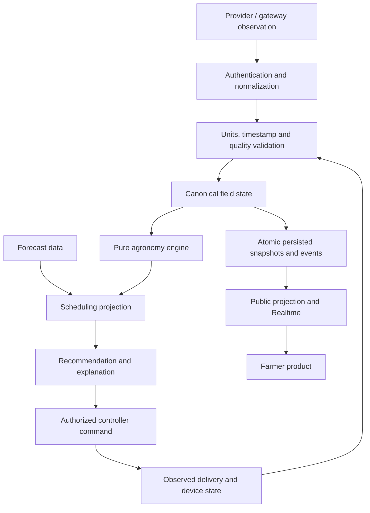

# Architecture

AgriFlow is one Next.js application. The root route is the irrigation product; the engineering workspace is protected at `/admin`. Hardware currently runs behind simulated adapters. The scientific model and application contracts are intended to remain when independently validated live adapters are introduced.

## Boundaries

Forecast input has no edge into actual water accounting. An expected rainfall amount is a planning input until an observation arrives.

| Layer | Responsibility |
|---|---|
| Domain | Scientific equations, versioned parameters, units, crop/soil state, decisions and simulation transitions; no React/database imports |
| Providers and validation | Vendor-neutral observation/control contracts; provenance, quality and freshness |
| Server | Verified identity, authorization, API validation and trusted calls to database transactions |
| Supabase | PostgreSQL persistence, Auth, RLS, immutable history, idempotency/concurrency and Realtime |
| UI | Read models, plain-language explanations, responsive visualization and interaction; no agronomic formulas |

## State ownership

The homogeneous field owns canonical root-zone and surface evaporation depletion. Four equal zones own irrigation targets, commands and delivery records. Gross delivered zone volumes are summed and converted into field-equivalent net depth exactly once. Separate zone soil balances require explicit configuration; never infer them merely because there are four valves.

Simulation state owns its injected clock, active scenario, physical command/observed state, accounting history and event sequence. Fixed internal steps make replay independent of how clients group elapsed-time requests. Store timestamps in UTC; render in `Asia/Tashkent`. A simulated reading's freshness is relative to the simulation clock, not today's wall clock.

Scientific parameter versions and calculation snapshots make historical recommendations reproducible. Parameter edits create new versions rather than rewriting the interpretation of previous calculations.

## Authoritative state versus preview

Anonymous visitors can read the public demo and explore session-local irrigation previews. Preview state is isolated from authoritative Supabase data and from other browsers. Both use the same deterministic engine.

Authenticated administrators can modify the shared simulation through authorized server routes. The application shell owns the simulation controller so navigation to a farmer page does not reset its timer. A closed controlling session stops stepping; this is deliberately not a permanent background job. Version checks reject competing stale writes, and idempotency keys prevent a retried request from delivering water twice.

## Persistence and delivery

Group state transitions, associated observations, recommendations, calculations and alerts in one transaction. Failure must leave no partial accounting. History reads are bounded and indexed; compact current-state changes notify the UI through Supabase Realtime instead of broadcasting raw telemetry histories.

Backend absence is a visible state. An explicitly identified local demonstration can remain explorable, but cannot impersonate a connected database, successful admin mutation or live hardware.

## Product decisions

Farmer routes are Today, Field, Irrigation, Forecast, History and Devices. Technical details appear on demand in the recommendation explanation. Admin navigation is outside the farmer navigation; access protection is still enforced independently.

One persistent product-level disclosure explains that field/device data are simulated. Value-level provenance remains available in the model and technical explanations. There are no unsupported water-saving/yield claims, fake confidence percentages or claims of FAO endorsement.

English is the current language. Branding, copy, unit formatting and assumptions are centralized to support future Uzbek/Russian translation without duplicating domain logic.

See [database](DATABASE.md), [security](SECURITY.md), [simulation](SIMULATION.md), and [hardware integration](HARDWARE_INTEGRATION.md) for operational contracts. [Build progress](BUILD_PROGRESS.md) distinguishes implemented behavior from checks actually run.
